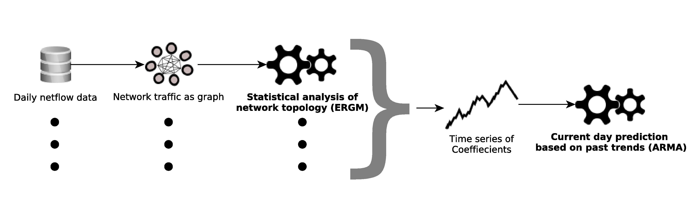

# TopoFlow

---------------------------------------------------------------

## WIP
Logstash plugin for network traffic data analysis using network topology and "flow". This is an open source and lightweight adaption of a research project. The full writeup for which can be found [here](ergmarma.pdf).

# Authors
Alex Emanuelson
alexeemanuelson@gmail.com

Scott Waldron
waldros2@gmail.com

# System
This project plugs into an established network packet capture platform using Logstash (ELK stack). Thus far, the focus is on detecting unlikely DNS traffic from the network, i.e. DNS exfiltration. 

1) Pull network data from logstash and construct DNS graph
2) Send graph through ERGM process to determine graph characteristic probabilities
3) Use probabilites to construct time series data
4) Train ARMA model over time period and forecast
5) Use standard deviation thresholding for anomaly detection
